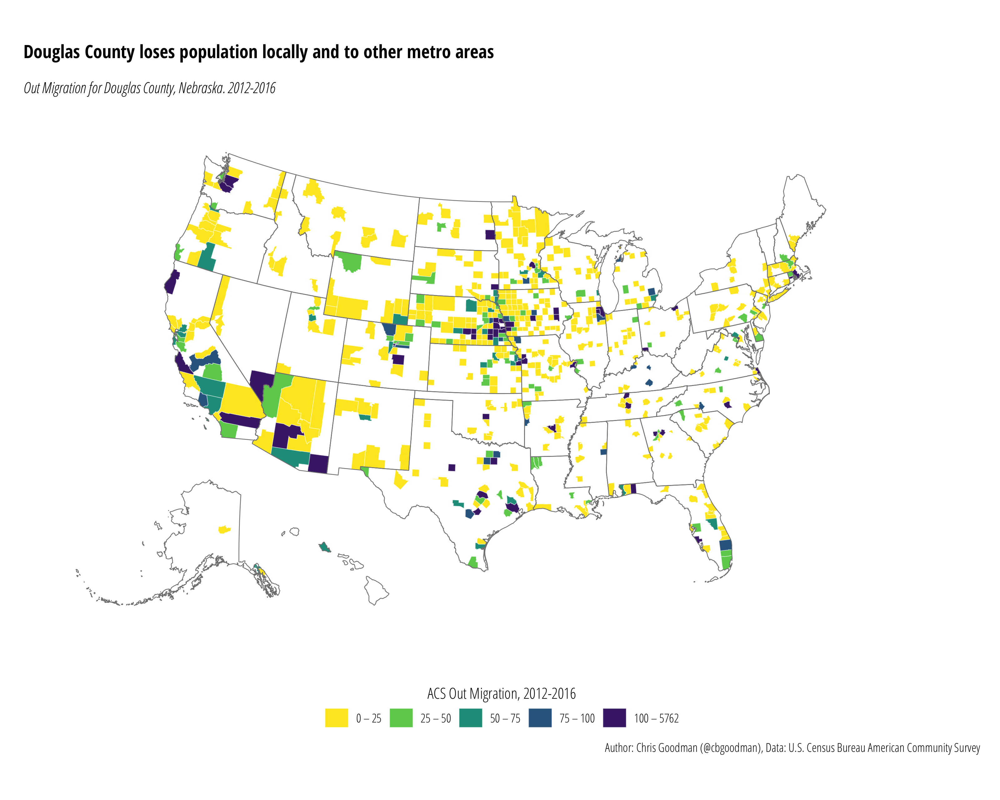
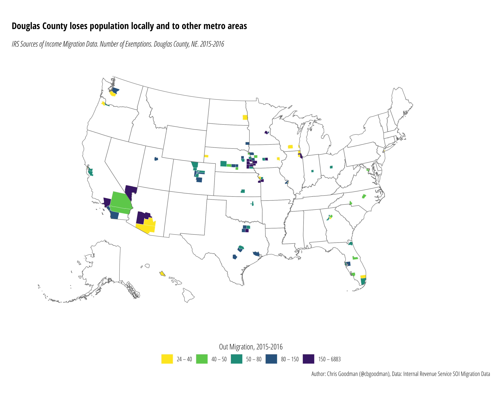

# Douglas County, NE Migration Patterns
There are two primary datasets of population migration in the U.S.: data on migration from the American Community Survey (ACS) and data from the Internal Revenue Service (IRS) derived from changes in address on tax filings. The below maps examine net and out-migration patterns of Douglas County, Nebraska for the most recent year (2016).

## American Community Survey Data
There are a number of migration related Census products derived from two primary sources: the CPS-ASEC and the ACS. The two below maps rely on the county to county migration flow data from the 2012-2016 American Community Survey extracted from the
[Census Flow Mapper](https://flowsmapper.geo.census.gov/map.html).

`douglas-acs-net.r` reads `douglas-acs-net.csv` to create the net migration map for Douglas County, NE seen below.

`douglas-acs-out.r` reads `douglas-acs-out.csv` to create the migration outflow map for Douglas County, NE seen below.

## Internal Revenue Service Sources of Income Migration Data
The [IRS SOI Tax Stats Migration Data](https://www.irs.gov/statistics/soi-tax-stats-migration-data) is based on year-to-year changes in address from individual income tax returns. Due to data privacy regulations, a number of counties are not reported. The map below is based on the outflow data.`douglas-irs-out.r` reads `douglas-irs-out.csv` to create the migration outflow map for Douglas County, NE seen below.

